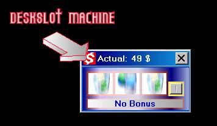



## DeskSlot machine

### Description

DeskSlot machine!! The desktop game that everyone must have!! Look the screenshot. A little slot machine hidable with a double click with bonuses and hold mode!! Try it! Scripted veeeeery easy.
 
### More Info
 

             |
---                |---
**Submitted On**   |2002-10-08 12:27:46
**By**             |[James Raynor](https://github.com/Planet-Source-Code/PSCIndex/blob/master/ByAuthor/james-raynor.md)
**Level**          |Beginner
**User Rating**    |4.7 (14 globes from 3 users)
**Compatibility**  |VB 6\.0
**Category**       |[Games](https://github.com/Planet-Source-Code/PSCIndex/blob/master/ByCategory/games__1-38.md)
**World**          |[Visual Basic](https://github.com/Planet-Source-Code/PSCIndex/blob/master/ByWorld/visual-basic.md)
**Archive File**   |[DeskSlot\_m1431941092002\.zip](https://github.com/Planet-Source-Code/james-raynor-deskslot-machine__1-39663/archive/master.zip)

